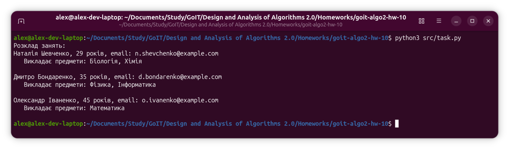

<p align="center">
  
</p>

#### [# goit-algo2-hw-10](https://github.com/topics/goit-algo2-hw-10) <!-- omit in toc -->

## Greedy scheduling algorithm implementation in Python <!-- omit in toc -->

This project implements a greedy set-cover algorithm to build a university class schedule - assigning the minimum number of teachers needed to cover all subjects.

## Table of Contents <!-- omit in toc -->
- [Requirements](#requirements)
  - [Description](#description)
  - [Technical Requirements](#technical-requirements)
  - [Acceptance Criteria](#acceptance-criteria)
- [Solution](#solution)
- [Project Setup \& Run Instructions](#project-setup--run-instructions)
  - [Prerequisites](#prerequisites)
  - [Setting Up the Development Environment](#setting-up-the-development-environment)
    - [Clone the Repository](#clone-the-repository)
  - [Run the code](#run-the-code)
    - [Run code locally](#run-code-locally)
      - [For Linux and macOS:](#for-linux-and-macos)
      - [For Windows:](#for-windows)
- [License](#license)

## Requirements

### Description

Implement a program for building a university class schedule using a greedy algorithm for the set cover problem. The goal is to assign teachers to subjects so that all subjects are covered while minimizing the number of teachers.

**Subjects:** Mathematics, Physics, Chemistry, Computer Science, Biology

**Teachers:**

| Name | Age | Email | Subjects |
|---|---|---|---|
| Oleksandr Ivanenko | 45 | o.ivanenko@example.com | Mathematics, Physics |
| Maria Petrenko | 38 | m.petrenko@example.com | Chemistry |
| Serhii Kovalenko | 50 | s.kovalenko@example.com | Computer Science, Mathematics |
| Natalia Shevchenko | 29 | n.shevchenko@example.com | Biology, Chemistry |
| Dmytro Bondarenko | 35 | d.bondarenko@example.com | Physics, Computer Science |
| Olena Hrytsenko | 42 | o.grytsenko@example.com | Biology |

### Technical Requirements

1. Implement a `Teacher` class with attributes: `first_name`, `last_name`, `age`, `email`, `can_teach_subjects`, `assigned_subjects`.
2. Implement `create_schedule(subjects, teachers)` using a greedy set-cover approach.
3. At each step select the teacher who covers the most uncovered subjects. Break ties by age (youngest first).
4. If full coverage is impossible, return `None` and print an appropriate message.

### Acceptance Criteria

1. The program covers all subjects from the subject set.
2. If coverage is impossible, the program prints an appropriate message.
3. All subjects are covered by teachers assigned according to their teachable subjects.

## Solution

The solution is located in [src/task.py](src/task.py).

`Teacher` stores personal info and a `can_teach_subjects` set. The `assigned_subjects` attribute (initially empty) is populated by `create_schedule` with the actual subjects assigned to that teacher.

`create_schedule` implements a greedy set-cover loop:
1. Find the teacher from the remaining pool who covers the most subjects not yet assigned. If there is a tie in coverage count, prefer the youngest teacher.
2. Assign the intersection of their subjects with the uncovered set.
3. Remove them from the pool and remove their subjects from the uncovered set.
4. Repeat until all subjects are covered or no progress is possible.

If no teacher in the remaining pool covers any uncovered subject, the function returns `None`.

**Result on the given dataset (5 subjects, 6 teachers):**

| Step | Teacher | Age | Subjects assigned |
|---|---|---|---|
| 1 | Natalia Shevchenko | 29 | Biology, Chemistry |
| 2 | Dmytro Bondarenko | 35 | Physics, Computer Science |
| 3 | Oleksandr Ivanenko | 45 | Mathematics |

3 teachers are sufficient to cover all 5 subjects. At each step multiple candidates tied on coverage count (2 subjects), so the youngest was selected.

Execution screenshot:



## Project Setup & Run Instructions

### Prerequisites

* Python 3.10 or later
* Git (optional, for cloning)

### Setting Up the Development Environment

#### Clone the Repository

```bash
git clone https://github.com/oleksandr-romashko/goit-algo2-hw-10.git
cd goit-algo2-hw-10
```

No external dependencies - all modules used are from the Python standard library.

### Run the code

#### Run code locally

##### For Linux and macOS:

```bash
python3 src/task.py
```

##### For Windows:

```bash
python src\task.py
```

## License

This project is licensed under the [MIT License](./LICENSE).
